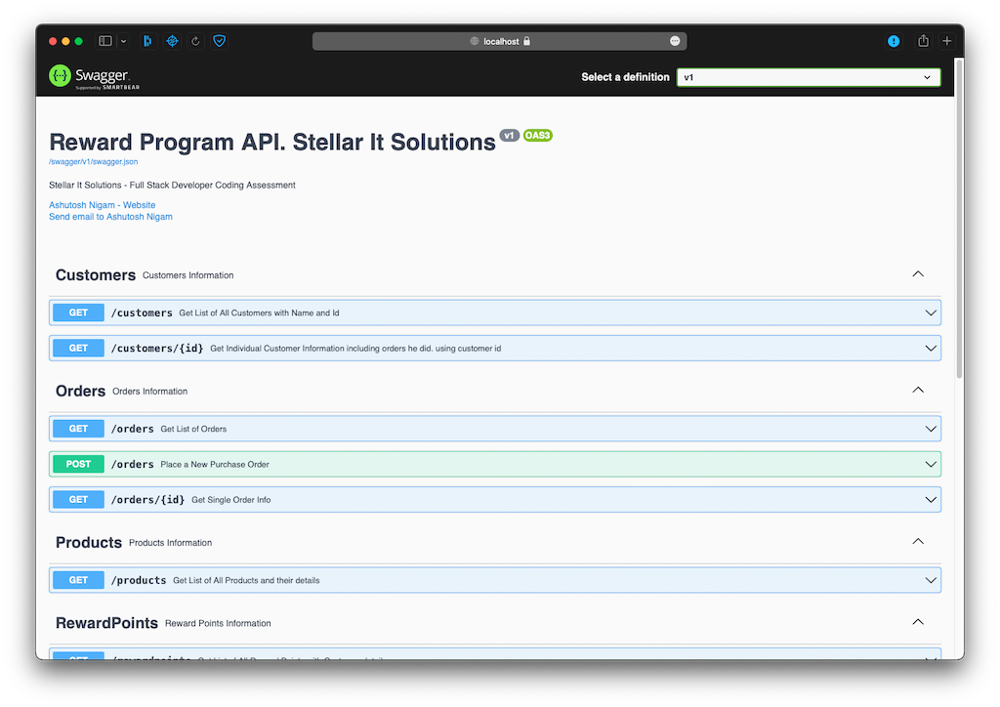

# Reward Program Coding Test
## Stellar It Solutions
From: [Ashutosh Nigam](https://www.ashutoshnigam.in),
[Contact No: +91 9630747751](callto:+919630747751),
[Email: mrashutoshnigam@gmail.com](emailto:mrashutoshnigam@gmail.com)
### Coding Challenge:
### Problem:
A retailer offers a rewards program to its customers awarding points based on each recorded purchase as follows:

For every dollar spent over $50 on the transaction, the customer receives one point.
In addition, for every dollar spent over $100, the customer receives another point.
Ex: for a $120 purchase, the customer receives
(120 - 50) x 1 + (120 - 100) x 1 = 90 points

### Solution
#### Language: C#.NET and WebAPI
#### Database : SQLite
#### Container: Docker
Solutions is Created using [Microsoft.NET WebAPI](https://dotnet.microsoft.com/en-us/apps/aspnet/apis). I used Sqlite as Database since it doesn't required extra database connection and required any script to run to create database.
Solution include a docker file which can be run directly else this image is uploaded to [docker hub](hub.docker.com), and can be downloaded form [docker hub](hub.docker.com) and run.

---
#### Swagger for APIs
APIs documentation is displayed using [Swagger](https://swagger.io).



---

#### Execution Steps:
1. Directly Running Solutions: 
   1. Prerequisite: 
      1. .NET Core 6.0 SDK
      2. VSCode or Visual Studio
      3. Git for downloading project file.
   2. Steps To Run:
      1. Visual Studio - Open project in Visual Studio and click on RUN button. 
      2. VSCode or Command/Terminal - Run following command
      ```shell
      cd RewardProgramAPI
      dotnet run
      ```
2. Docker Image Build
   1. Prerequisite: 
      1. Docker Desktop
   2. Steps To Run:
      1. Open terminal and Navigate to Project Folder
      2. Run following command to build and then run image in port 80
      ```shell
      docker build -t reward-points-api .
      docker run -it --name reward-program-container -p 80:80 reward-points-api 
      ```
   3. Open Web Browse and Navigate to [localhost:80//index.html](localhost:80//index.html)
3. Download Docker Image from [docker hub - hub.docker.com](hub.docker.com) 
    1. Prerequisite:
        1. Docker Desktop
    2. Steps To Run:
        1. Open terminal and Run following command to download and run image in port 80
       ```shell
       docker pull ashutosh456/reward-points-api
       docker run -it --name RewardProgramContainer -p 80:80 ashutosh456/reward-points-api
       ```
    3. Open Web Browse and Navigate to [localhost:80//index.html](localhost:80//index.html)

